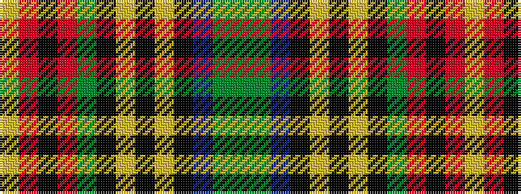

GGBKYKYKGRKRY

It is a 13 stripe tartan.

<figure class="pat-woven">

<figcaption>idealised sample</figcaption>
</figure>

## Colour Sequence



## Tartans with this colour sequence

| Tartans |
|---------------|
| [Princess Mary #2](/setts/s13/g24g2b2k3lo1k1lr1k1g4r2k1r2lr1~x4/)|
||
