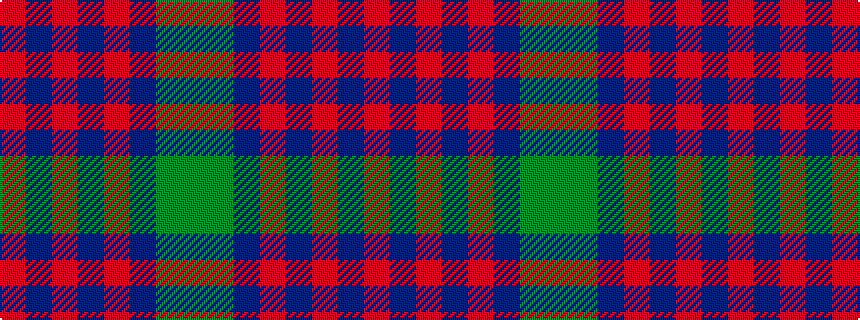

GGBRBRBR

It is a 8 stripe tartan.

<figure class="pat-woven">

<figcaption>idealised sample</figcaption>
</figure>

## Colour Sequence



## Tartans with this colour sequence

| Tartans |
|---------------|
| [Cranston Dress](/setts/s8/r15db2r1db2r3db7g13gi3~x2/)|
||
| [Cranston Dress Family Tartan Tartan Number: 753. Earliest known date: pre 2003 Restricted See products available Copyright © Blair Urquhart, Comrie, 2015](/setts/s8/r30db3r2db3r6db14g26gi6/)|
||
| [Cranston, dress](/setts/s8/r30db3r2db3r6db14gi26g6/)|
||
