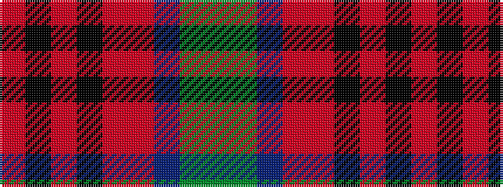

GGBRRKRKR

It is a 9 stripe tartan.

<figure class="pat-woven">

<figcaption>idealised sample</figcaption>
</figure>

## Colour Sequence



## Tartans with this colour sequence

| Tartans |
|---------------|
| [Somerset](/variants/s9/g8y8t7r5o2k2o2k2o2~x2/)|
||
