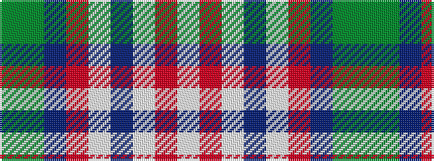

GGBRWBWRW

It is a 9 stripe tartan.

<figure class="pat-woven">

<figcaption>idealised sample</figcaption>
</figure>

## Colour Sequence



## Tartans with this colour sequence

| Tartans |
|---------------|
| [MacNiven](/variants/s9/gi18g2db5r45lbi3db18lbi3r8lb2~x2/)|
||
