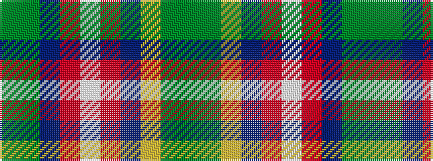

GGBRWRBYGG

It is a 10 stripe tartan.

<figure class="pat-woven">

<figcaption>idealised sample</figcaption>
</figure>

## Colour Sequence



## Tartans with this colour sequence

| Tartans |
|---------------|
| [Swiss Highlander](/setts/s10/g12g24b48r23w8r23b24ly4g12g12/)|
||
| [Swiss Highlander (Corporate)](/setts/s10/dg12g24t48r23w8r23t24ly4g12dg12/)|
||
