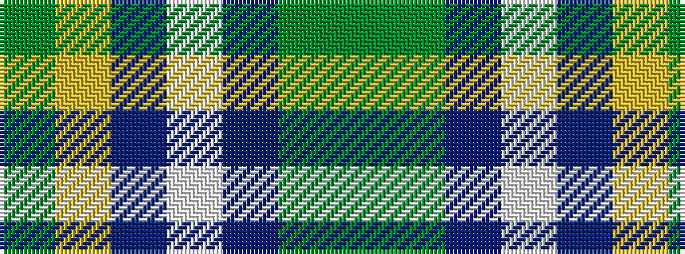

GGBWBYG

It is a 7 stripe tartan.

<figure class="pat-woven">

<figcaption>idealised sample</figcaption>
</figure>

## Colour Sequence



## Tartans with this colour sequence

| Tartans |
|---------------|
| [Northern Ontario](/variants/s7/dy17g5db2w12db2ly4g7~x4/)|
||
