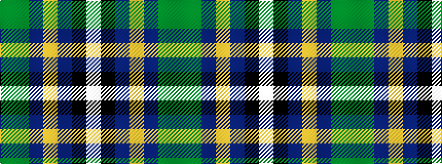

GGBYBKW

It is a 7 stripe tartan.

<figure class="pat-woven">

<figcaption>idealised sample</figcaption>
</figure>

## Colour Sequence



## Tartans with this colour sequence

| Tartans |
|---------------|
| [Hughes](/variants/s7/dgi20dg14db9ly2db9k1w2~x4/)|
||
| [Hughes](/variants/s7/g20dg14db9ly2db9k1w2~x4/)|
||
| [Hughes (Inverbervie) (Personal)](/variants/s7/g36dg24b18ly4b18k2w5~x2/)|
||
