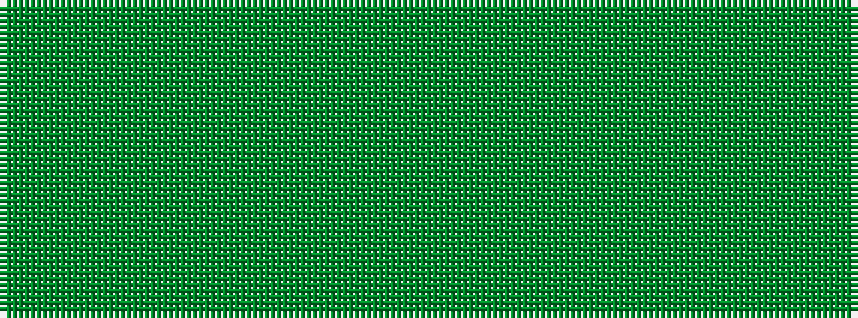

GGG

It is a 3 stripe tartan.

<figure class="pat-woven">

<figcaption>idealised sample</figcaption>
</figure>

## Colour Sequence



## Tartans with this colour sequence

| Tartans |
|---------------|
| [Hallstatt (Artefact)](/variants/s3/dy16y3dy2~x10/)|
||
