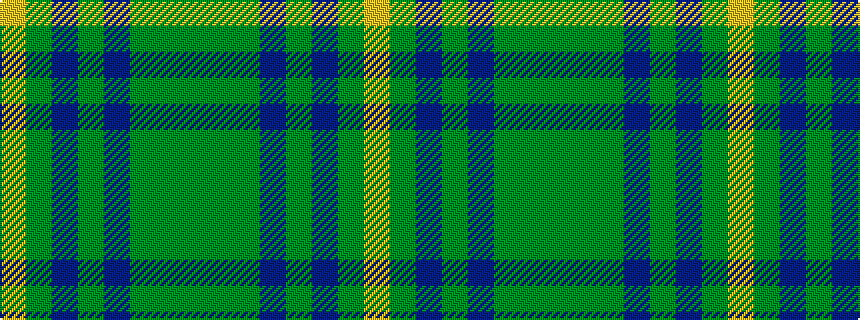

GGGBGBGY

It is a 8 stripe tartan.

<figure class="pat-woven">

<figcaption>idealised sample</figcaption>
</figure>

## Colour Sequence



## Tartans with this colour sequence

| Tartans |
|---------------|
| [Eastern Western Motor Group, Dalbraith](/variants/s8/dy28g2dy4db18g23db2g3lo4~x2/)|
||
