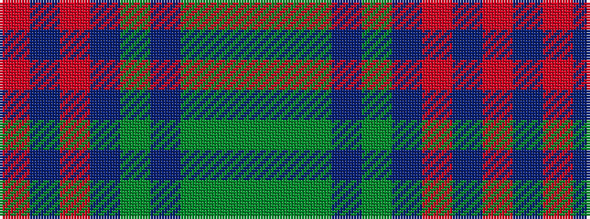

GGGBGBRBR

It is a 9 stripe tartan.

<figure class="pat-woven">

<figcaption>idealised sample</figcaption>
</figure>

## Colour Sequence



## Tartans with this colour sequence

| Tartans |
|---------------|
| [Copar a'Beannichte (Personal)](/setts/s9/g20gi6dg15dt5dg2dt15o4dt10r2~x2/)|
||
