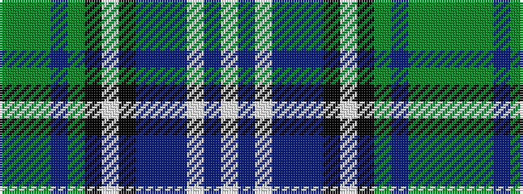

GGGBGKWKBBBWBW

It is a 14 stripe tartan.

<figure class="pat-woven">

<figcaption>idealised sample</figcaption>
</figure>

## Colour Sequence



## Tartans with this colour sequence

| Tartans |
|---------------|
| [Redgate (Connecticut) Dress](/setts/s14/w7t4w2t7dr2t7k6w1k6dy5t3dy3dg13dy4~x2/)|
||
