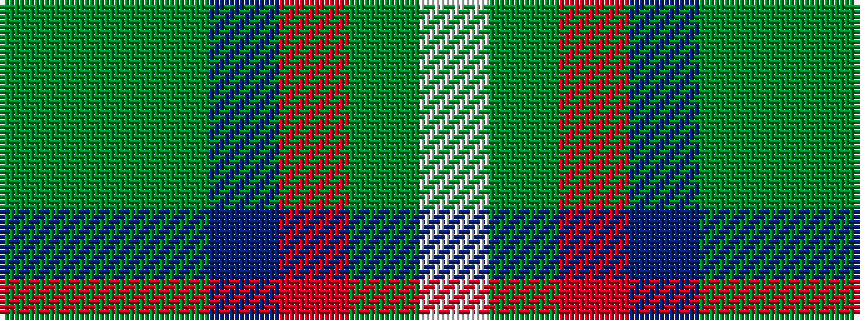

GGGBRGW

It is a 7 stripe tartan.

<figure class="pat-woven">

<figcaption>idealised sample</figcaption>
</figure>

## Colour Sequence



## Tartans with this colour sequence

| Tartans |
|---------------|
| [Nicolson of Taransay (Personal)](/setts/s7/w6gi10r22db16g2g4g5~x2/)|
||
