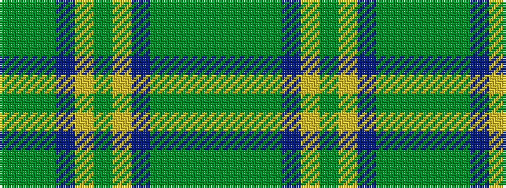

GGGBYGYBGGGG

It is a 12 stripe tartan.

<figure class="pat-woven">

<figcaption>idealised sample</figcaption>
</figure>

## Colour Sequence



## Tartans with this colour sequence

| Tartans |
|---------------|
| [Strange of Balcaskie (Personal)](/setts/s12/g32dy7g7dy16db32ly3dy8~x2/)|
||
