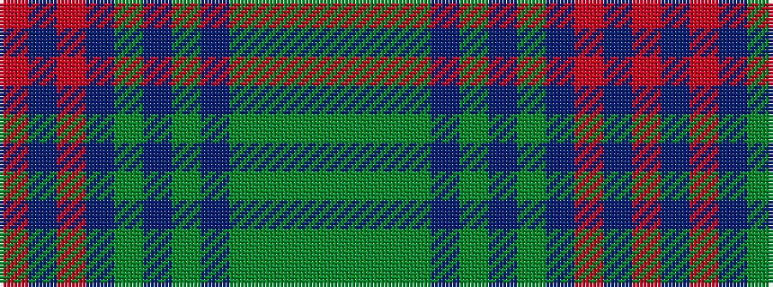

GGGGBGBGBRBR

It is a 12 stripe tartan.

<figure class="pat-woven">

<figcaption>idealised sample</figcaption>
</figure>

## Colour Sequence



## Tartans with this colour sequence

| Tartans |
|---------------|
| [Pacific](/variants/s12/g2dg2g1dg14b2dg10b10dg2b14m1b2m2~x4/)|
||
