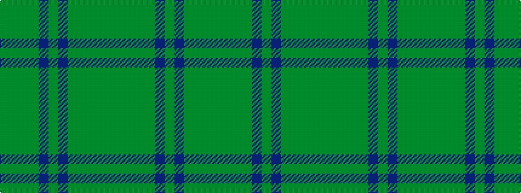

GGGGBGBGGGGG

It is a 12 stripe tartan.

<figure class="pat-woven">

<figcaption>idealised sample</figcaption>
</figure>

## Colour Sequence



## Tartans with this colour sequence

| Tartans |
|---------------|
| [de Meuron (Family)](/variants/s12/y9g13dg26dy6dp5dy40dp5dy6dg26g13y9dg3~x2/)|
||
