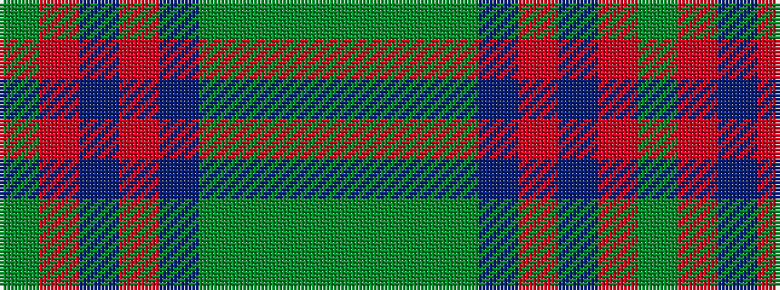

GGGGBRBRG

It is a 9 stripe tartan.

<figure class="pat-woven">

<figcaption>idealised sample</figcaption>
</figure>

## Colour Sequence



## Tartans with this colour sequence

| Tartans |
|---------------|
| [O'Brien (Scotch Corner)](/setts/s9/y36g19y4g31b2r3b2r3g12~x2/)|
||
