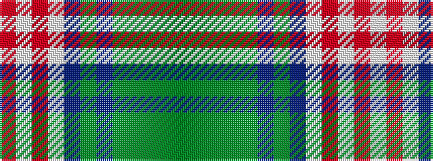

GGGGGBGBWRWR

It is a 12 stripe tartan.

<figure class="pat-woven">

<figcaption>idealised sample</figcaption>
</figure>

## Colour Sequence



## Tartans with this colour sequence

| Tartans |
|---------------|
| [Ross Hunting Dress](/variants/s12/dg4g3dg3g4dg4db8dg3db9w29r2w4r2~x2/)|
||
