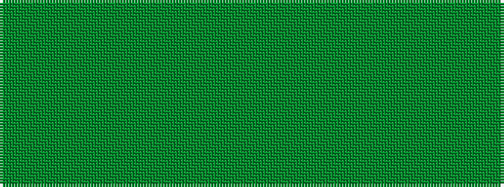

GGGGGGG

It is a 7 stripe tartan.

<figure class="pat-woven">

<figcaption>idealised sample</figcaption>
</figure>

## Colour Sequence



## Tartans with this colour sequence

| Tartans |
|---------------|
| [MacKinnon Htg (Clan)](/setts/s7/dy1g8dy8g1dy8g8dy1~x4/)|
||
