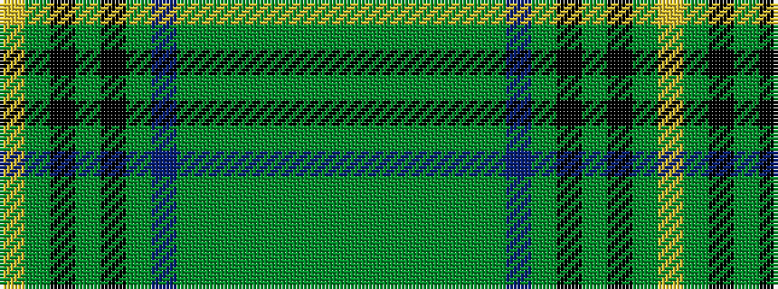

GGGGGGGBGKGKGY

It is a 14 stripe tartan.

<figure class="pat-woven">

<figcaption>idealised sample</figcaption>
</figure>

## Colour Sequence



## Tartans with this colour sequence

| Tartans |
|---------------|
| [Beatrice, Princess.. (hunting)](/setts/s14/gi10gi5g5gi5g60gi13g10db67g5k5g5k5g13ly10/)|
||
