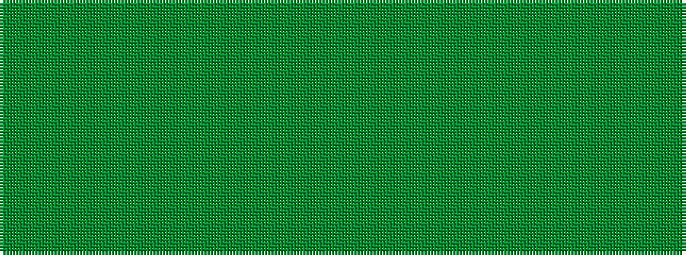

GGGGGGGG

It is a 8 stripe tartan.

<figure class="pat-woven">

<figcaption>idealised sample</figcaption>
</figure>

## Colour Sequence



## Tartans with this colour sequence

| Tartans |
|---------------|
| [Ancient Universal (Fashion?)](/variants/s8/yi12dg2yi2dg2yi2dy8y8dy1~x2/)|
||
| [Semper](/variants/s8/gi16dg1y4dg41y1dg6g2dg2~x2/)|
||
