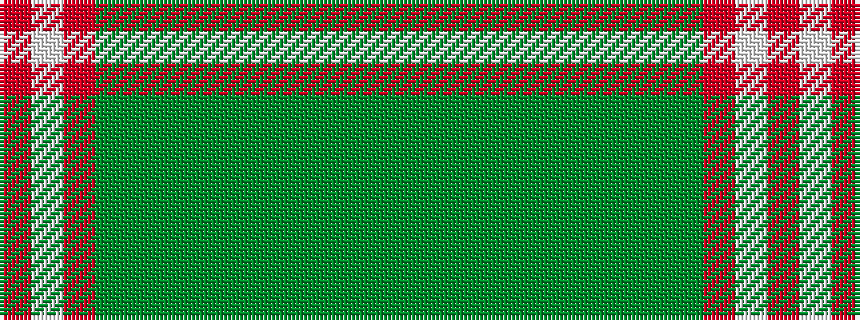

GGGGGGGGGGRWR

It is a 13 stripe tartan.

<figure class="pat-woven">

<figcaption>idealised sample</figcaption>
</figure>

## Colour Sequence



## Tartans with this colour sequence

| Tartans |
|---------------|
| [Pino (Personal)](/setts/s13/dg25g7dg25g7g5dg25g7dg25g7g5r2w2r2~x2/)|
||
