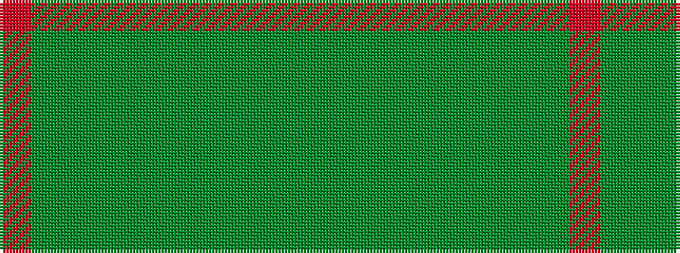

GGGGGGGGGR

It is a 10 stripe tartan.

<figure class="pat-woven">

<figcaption>idealised sample</figcaption>
</figure>

## Colour Sequence



## Tartans with this colour sequence

| Tartans |
|---------------|
| [Connacht](/setts/s10/o64dg4dyi1dg4dyi1dg4dyi64dy2dyi2dy8~x2/)|
||
