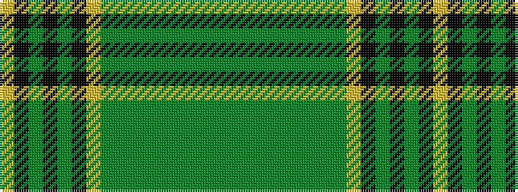

GGGGGGGGGYKGKGKY

It is a 16 stripe tartan.

<figure class="pat-woven">

<figcaption>idealised sample</figcaption>
</figure>

## Colour Sequence



## Tartans with this colour sequence

| Tartans |
|---------------|
| [Hanly](/variants/s16/g2dg2g3dg2g2dg2g2dg3g2lr2k9dg26k5g7k2ly2~x2/)|
||
