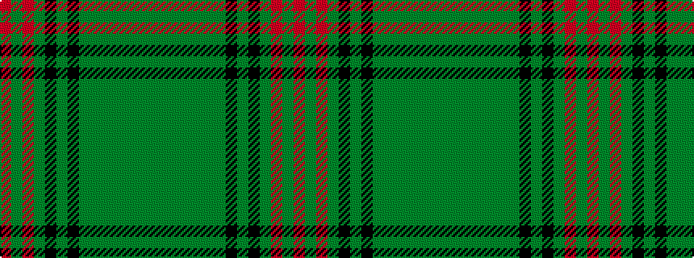

GGGGGGGKGKGRGR

It is a 14 stripe tartan.

<figure class="pat-woven">

<figcaption>idealised sample</figcaption>
</figure>

## Colour Sequence



## Tartans with this colour sequence

| Tartans |
|---------------|
| [Ross Hunting](/variants/s14/dg2g4dg2g1dg1g1dg3k2dg2k2dg12r1dg2r1~x2/)|
||
| [Ross Hunting #3](/variants/s14/gi5g7gi4g2gi2g3gi4k6gi3k6gi34r2gi4r2~x2/)|
||
| [Ross Hunting Clan Tartan](/variants/s14/gi2g4gi2g2gi1g2gi3k2gi2k2gi12r1gi2r1~x2/)|
||
| [Ross, hunting](/variants/s14/g2gi4g2gi1g1gi1g3k2g2k2g12r1g2r1~x2/)|
||
