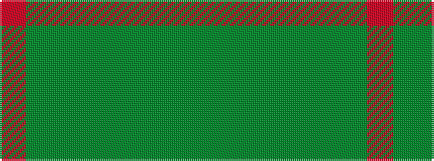

GGGGGGGR

It is a 8 stripe tartan.

<figure class="pat-woven">

<figcaption>idealised sample</figcaption>
</figure>

## Colour Sequence



## Tartans with this colour sequence

| Tartans |
|---------------|
| [Tomass](/setts/s8/r2dy1dg9y1dy2y6g2y1~x4/)|
||
