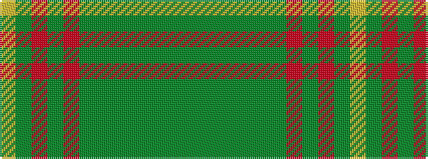

GGGGGGGRGRGY

It is a 12 stripe tartan.

<figure class="pat-woven">

<figcaption>idealised sample</figcaption>
</figure>

## Colour Sequence



## Tartans with this colour sequence

| Tartans |
|---------------|
| [INSEAD](/setts/s12/lo3g15r2g2r6g2dg6g2dg2g23g2g2~x2/)|
||
