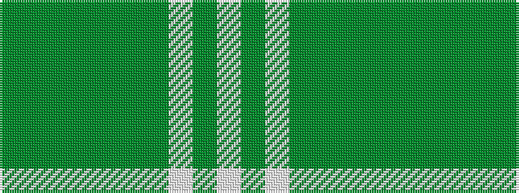

GGGGGGGWGW

It is a 10 stripe tartan.

<figure class="pat-woven">

<figcaption>idealised sample</figcaption>
</figure>

## Colour Sequence



## Tartans with this colour sequence

| Tartans |
|---------------|
| [Unidentified Plaid #2](/setts/s10/dg32dy2dg2dy2dg2dy12dg22w1dg1w3~x2/)|
||
