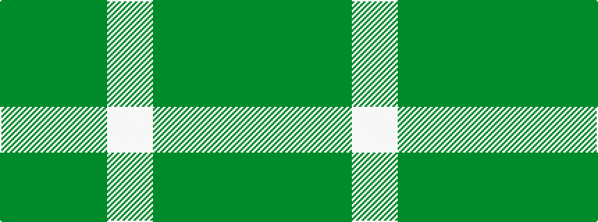

GGGGGGGWW

It is a 9 stripe tartan.

<figure class="pat-woven">

<figcaption>idealised sample</figcaption>
</figure>

## Colour Sequence



## Tartans with this colour sequence

| Tartans |
|---------------|
| [Stirling Millennium](/variants/s9/lp2w1y1g1gi1dg1y1g1dg1~x20/)|
||
