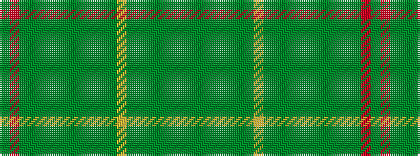

GGGGGGGYGGGGGGGGGGRG

It is a 20 stripe tartan.

<figure class="pat-woven">

<figcaption>idealised sample</figcaption>
</figure>

## Colour Sequence



## Tartans with this colour sequence

| Tartans |
|---------------|
| [Ebronen (Personal)](/variants/s20/dy2r30dy6g2dyi6dy6g2dy24y2dy4y2dyi24lo2dy6y6dg2dy6dg2y27dy1~x2/)|
||
| [Ebronen (Personal)](/variants/s20/dy2r30dy6g2dyi6dy6gi2dy24y2dy4y2dyi24lo2dy6y6dg2dy6dg2y27dy1~x2/)|
||
