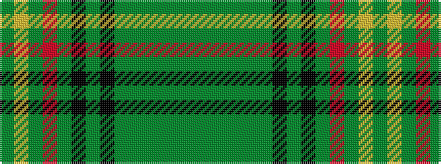

GGGGGGKGKGRGYG

It is a 14 stripe tartan.

<figure class="pat-woven">

<figcaption>idealised sample</figcaption>
</figure>

## Colour Sequence



## Tartans with this colour sequence

| Tartans |
|---------------|
| [New South Wales](/setts/s14/g3ly1g3r1g14k2g3k1g3gi1g2gi1g2gi3~x4/)|
||
