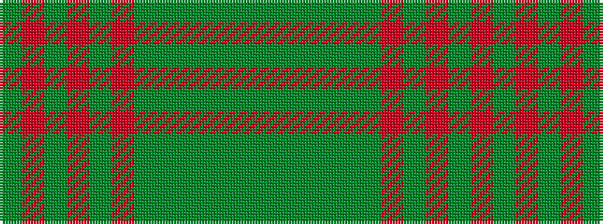

GGGGGGRGRGRG

It is a 12 stripe tartan.

<figure class="pat-woven">

<figcaption>idealised sample</figcaption>
</figure>

## Colour Sequence



## Tartans with this colour sequence

| Tartans |
|---------------|
| [Highlander (Corporate)](/variants/s12/dg33dg4dg4dg4dg5dg13o13dg13o2dg11o1dg2~x2/)|
||
