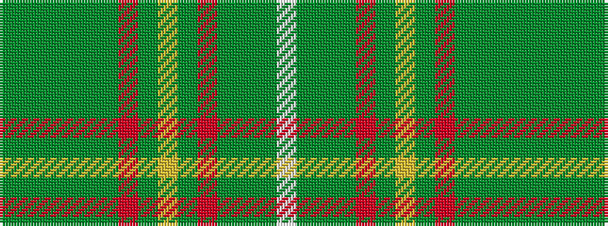

GGGGGGRGYGRGGGW

It is a 15 stripe tartan.

<figure class="pat-woven">

<figcaption>idealised sample</figcaption>
</figure>

## Colour Sequence



## Tartans with this colour sequence

| Tartans |
|---------------|
| [Prince Edward Island (District)](/variants/s15/g20dy2g4dy2g4dy18r18dy1ly4dy1r18dy18g18dy1w4~x2/)|
||
| [Prince Edward Island District Tartan](/variants/s15/g16dy1g2dy1g2dy12m12dy1ly2dy1m12dy12g12dy1w2~x2/)|
||
