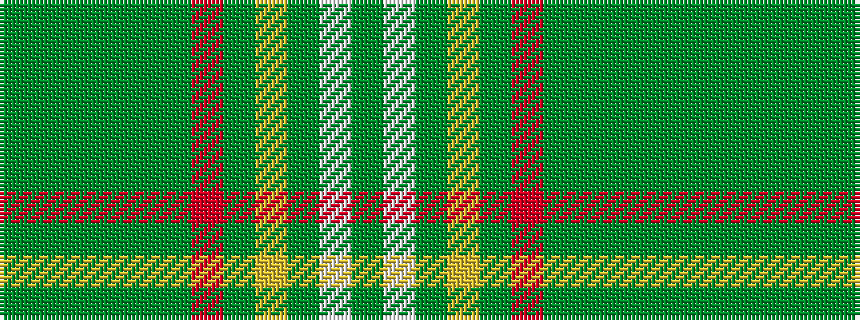

GGGGGGRGYGWG

It is a 12 stripe tartan.

<figure class="pat-woven">

<figcaption>idealised sample</figcaption>
</figure>

## Colour Sequence



## Tartans with this colour sequence

| Tartans |
|---------------|
| [Women's Royal Army Corps Ass. (Corp.](/variants/s12/dg10w2dg10ly1dg10r2dg24g1dg2g1dg2g2~x2/)|
||
