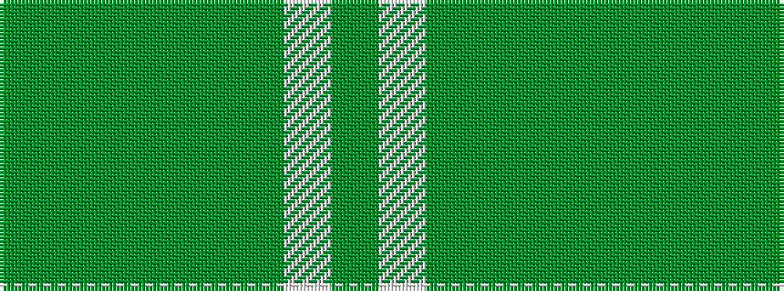

GGGGGGWG

It is a 8 stripe tartan.

<figure class="pat-woven">

<figcaption>idealised sample</figcaption>
</figure>

## Colour Sequence



## Tartans with this colour sequence

| Tartans |
|---------------|
| [Snaefell (District)](/variants/s8/y22dy2y2dy2y2dy14w16dy3~x2/)|
||
