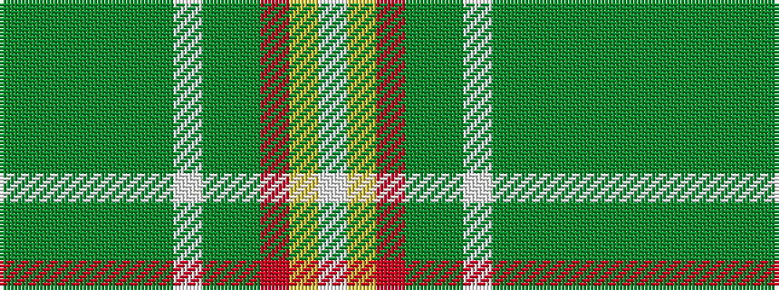

GGGGGGWGGRYW

It is a 12 stripe tartan.

<figure class="pat-woven">

<figcaption>idealised sample</figcaption>
</figure>

## Colour Sequence



## Tartans with this colour sequence

| Tartans |
|---------------|
| [Springbok](/setts/s12/dg3g2dg40dy2dg4dy8w1g4dg2o4ly4w2~x2/)|
||
