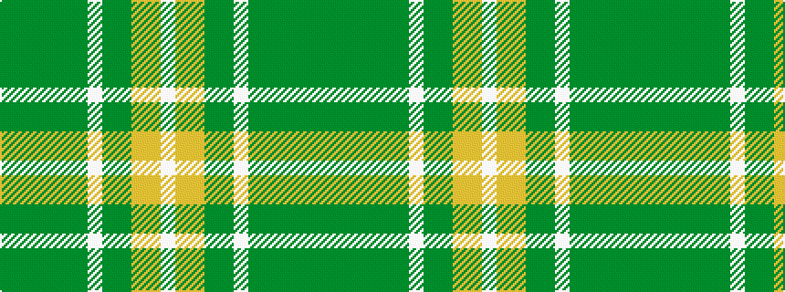

GGGGGGWGGYYW

It is a 12 stripe tartan.

<figure class="pat-woven">

<figcaption>idealised sample</figcaption>
</figure>

## Colour Sequence



## Tartans with this colour sequence

| Tartans |
|---------------|
| [Springbok (Fashion)](/setts/s12/dg3gi2dg40g2dg4g8w1gi4dg2lo4ly4w2~x2/)|
||
