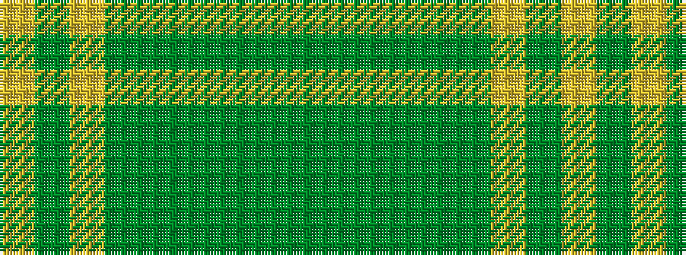

GGGGGGYGY

It is a 9 stripe tartan.

<figure class="pat-woven">

<figcaption>idealised sample</figcaption>
</figure>

## Colour Sequence



## Tartans with this colour sequence

| Tartans |
|---------------|
| [Kildonan Green (Fashion)](/setts/s9/g22dg3g3dg3g3dg9lr28dg3lr6~x2/)|
||
