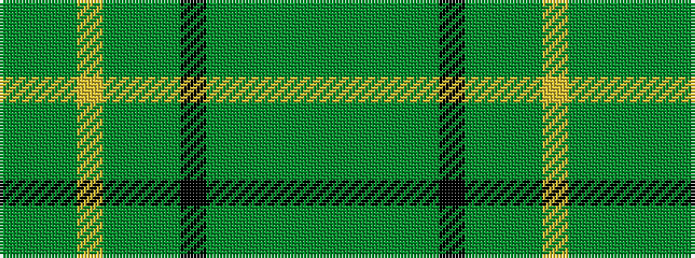

GGGGGKGGGYGGG

It is a 13 stripe tartan.

<figure class="pat-woven">

<figcaption>idealised sample</figcaption>
</figure>

## Colour Sequence



## Tartans with this colour sequence

| Tartans |
|---------------|
| [O'Neill, Martin](/setts/s13/g24g2g4g16g1k2g1g16g3ly1g12y2g5~x2/)|
||
