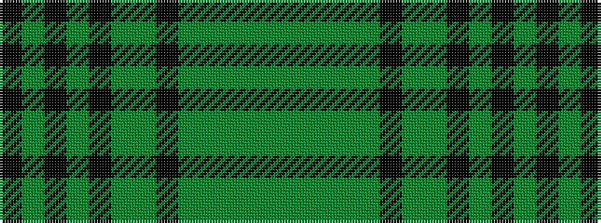

GGGGGKGGKGKGK

It is a 13 stripe tartan.

<figure class="pat-woven">

<figcaption>idealised sample</figcaption>
</figure>

## Colour Sequence



## Tartans with this colour sequence

| Tartans |
|---------------|
| [Wells, Greg #2 (Personal)](/variants/s13/k12g1k2g1k12g2g12k1g12g2g12g3g12~x2/)|
||
