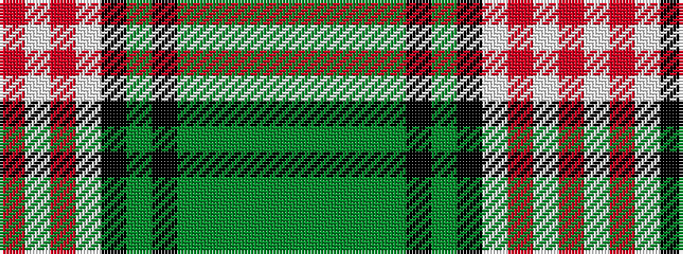

GGGGGKGKWRWR

It is a 12 stripe tartan.

<figure class="pat-woven">

<figcaption>idealised sample</figcaption>
</figure>

## Colour Sequence



## Tartans with this colour sequence

| Tartans |
|---------------|
| [Ross Arisaid](/setts/s12/r4w4r2w29k10gi3k10gi4g4gi3g3gi3~x2/)|
||
| [Ross, hunting dress](/setts/s12/g4gi3g3gi4g4k8g3k9w29r2w4r2~x2/)|
||
