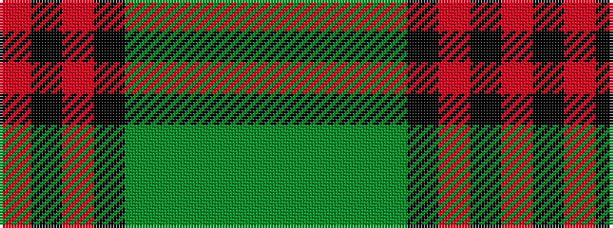

GGGGGKRKR

It is a 9 stripe tartan.

<figure class="pat-woven">

<figcaption>idealised sample</figcaption>
</figure>

## Colour Sequence



## Tartans with this colour sequence

| Tartans |
|---------------|
| [Lindsay](/setts/s9/g12dg1g1dg1g1k5r10k1r2~x2/)|
||
| [Lindsay #2](/setts/s9/dg12dg1dg1dg1dg1k5r10k1r2~x2/)|
||
