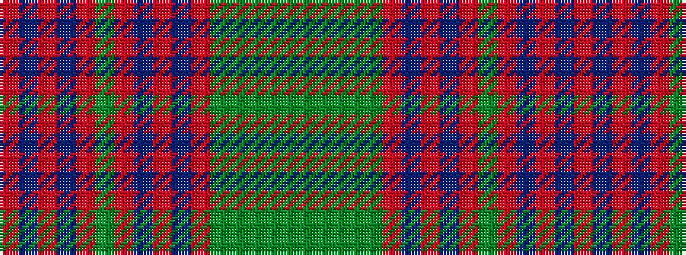

GGGGGRBRBRGRBRBR

It is a 16 stripe tartan.

<figure class="pat-woven">

<figcaption>idealised sample</figcaption>
</figure>

## Colour Sequence



## Tartans with this colour sequence

| Tartans |
|---------------|
| [O'Brian #1 (Fashion)](/variants/s16/r31db2r3db2r3g12r3db2r3db2r31dy4g19dy36g19dy4~x2/)|
||
