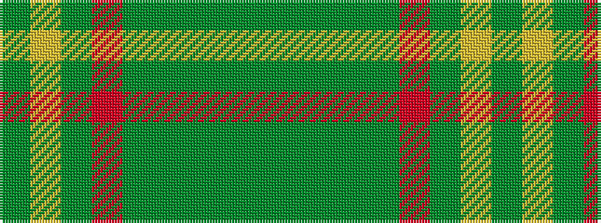

GGGGGRGYG

It is a 9 stripe tartan.

<figure class="pat-woven">

<figcaption>idealised sample</figcaption>
</figure>

## Colour Sequence



## Tartans with this colour sequence

| Tartans |
|---------------|
| [Fitzgibbon (Name)](/variants/s9/dg2lo6g24r2y2dg1y6dg10g2~x2/)|
||
