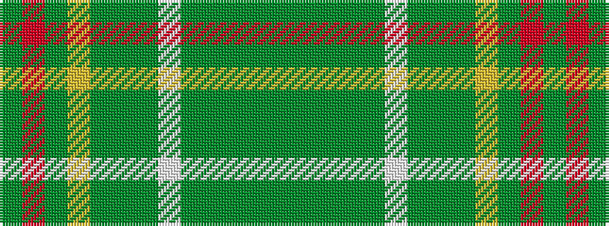

GGGGGWGGGYGRG

It is a 13 stripe tartan.

<figure class="pat-woven">

<figcaption>idealised sample</figcaption>
</figure>

## Colour Sequence



## Tartans with this colour sequence

| Tartans |
|---------------|
| [O'Neill (Personal)](/variants/s13/dg24g2dg4g16dg1lb2dg1g16dg3ly1dg12o2dg5~x2/)|
||
