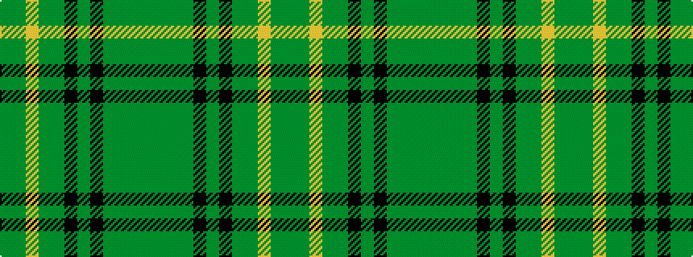

GGGGKGKGGYGG

It is a 12 stripe tartan.

<figure class="pat-woven">

<figcaption>idealised sample</figcaption>
</figure>

## Colour Sequence



## Tartans with this colour sequence

| Tartans |
|---------------|
| [Buchanan Hunting #2](/variants/s12/dy14y3dy14g14k14g5k14g14dy14ly3dy14g14~x2/)|
||
