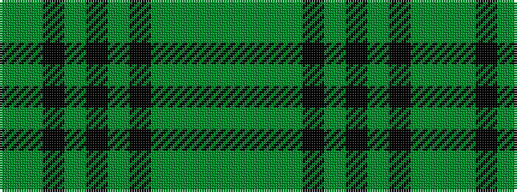

GGGGKGKGKGG

It is a 11 stripe tartan.

<figure class="pat-woven">

<figcaption>idealised sample</figcaption>
</figure>

## Colour Sequence



## Tartans with this colour sequence

| Tartans |
|---------------|
| [Blackwater (Fashion)](/setts/s11/g2gi16g2gi4k4g2k7gi2k4g17gi2~x2/)|
||
