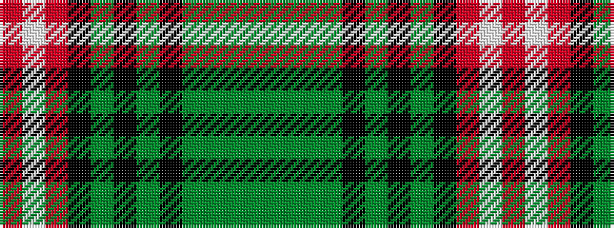

GGGGKGKGKRWR

It is a 12 stripe tartan.

<figure class="pat-woven">

<figcaption>idealised sample</figcaption>
</figure>

## Colour Sequence



## Tartans with this colour sequence

| Tartans |
|---------------|
| [Iona](/setts/s12/r8lb2r22k10dg6k6dg10k6dg10dg3dg3dg4~x2/)|
||
