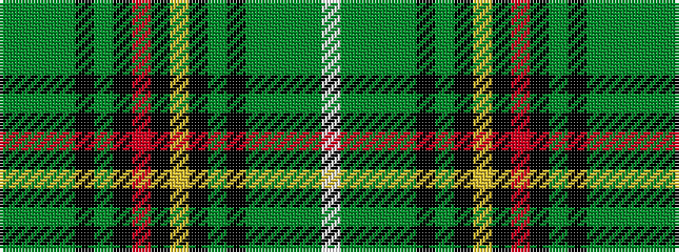

GGGGKGKRKYKGKGGGGW

It is a 18 stripe tartan.

<figure class="pat-woven">

<figcaption>idealised sample</figcaption>
</figure>

## Colour Sequence



## Tartans with this colour sequence

| Tartans |
|---------------|
| [Rooney (Personal)](/variants/s18/y36g12y4g72k4g13k36r4k4ly4k36g13k4g72y4g12y36w4/)|
||
