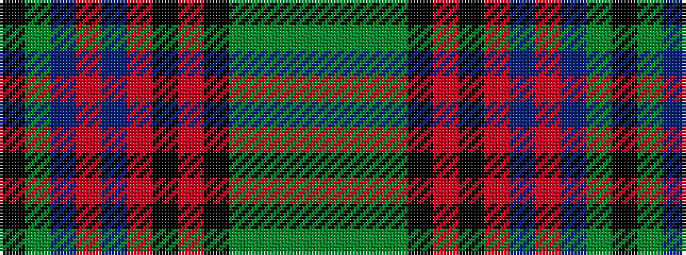

GGGGKRKRBRBGK

It is a 13 stripe tartan.

<figure class="pat-woven">

<figcaption>idealised sample</figcaption>
</figure>

## Colour Sequence



## Tartans with this colour sequence

| Tartans |
|---------------|
| [Strathtay](/setts/s13/y6dg2y2dg5k20o2k2o25dr2o2dr4dy10k2~x2/)|
||
