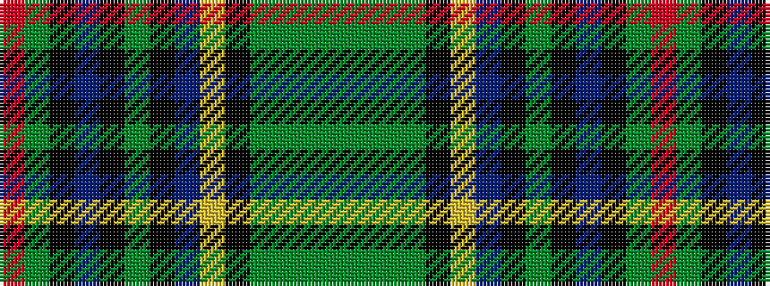

GGGGKYBKGKBKGR

It is a 14 stripe tartan.

<figure class="pat-woven">

<figcaption>idealised sample</figcaption>
</figure>

## Colour Sequence



## Tartans with this colour sequence

| Tartans |
|---------------|
| [Leinster](/setts/s14/r3gi18k10db12k1g2k1db12ly2k10g2gi2g15gi3~x2/)|
||
